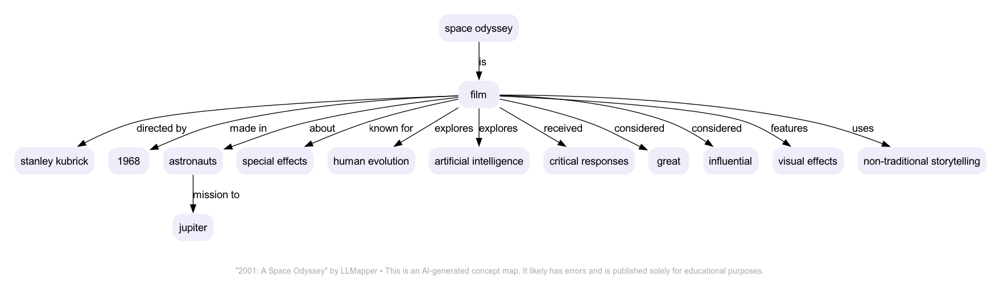

# LLMapper

An experiment in using LLMs to draw simple concept maps. Currently, a simple bash script that uses Simon Willison's [llm](https://github.com/simonw/llm), [strip-tags](https://github.com/simonw/strip-tags), and [ttok](https://github.com/simonw/ttok) tools to generate a PNG via [Graphviz](https://graphviz.org). 

LLMapper is a crude prototype for refining the prompts. Which is to say, this isn't (yet) a serious tool; it's a toy for learning about generative AI. 

It's very early days. Among other things, there's no error detection or graceful failures. Use at your own risk.

## Requirements

The script runs in a bash shell. It's only been tested in macOS, but will likely work in Linux with minor changes.

Dependencies:

- [llm](https://github.com/simonw/llm)
- [strip-tags](https://github.com/simonw/strip-tags)
- [ttok](https://github.com/simonw/ttok)
- [curl](https://curl.se)
- [Graphviz](https://graphviz.org)
- [ImageMagick](https://imagemagick.org)

Except where noted, llm uses GPT-4 in this script. If you don't have access to the paid version of OpenAI's API, replace the model (-m) option on the llm calls. 

## Usage

Pass llmapper a Wikipedia URL. E.g.:

`./llmapper https://en.wikipedia.org/wiki/2001:_A_Space_Odyssey`

Try running it several times. The map will be different each time.

## Sample Output

See more samples at [modelor.ai](https://modelor.ai).

## How It Works

1. curl retrieves the URL's content.
2. strip-tags filters everything out except the div with the article's body.
3. ttok truncates the article to 8,000 tokens
4. llm summarizes the truncated article
5. The summary is cleaned up and piped to an llm prompt that formats it as RDF.
6. The RDF is passed to another llm that translates it to [DOT](https://graphviz.org/doc/info/lang.html) code for rendering as a concept map in Graphviz.
7. A sequence of additional calls to ImageMagick tools adds margins and the bottom caption.
